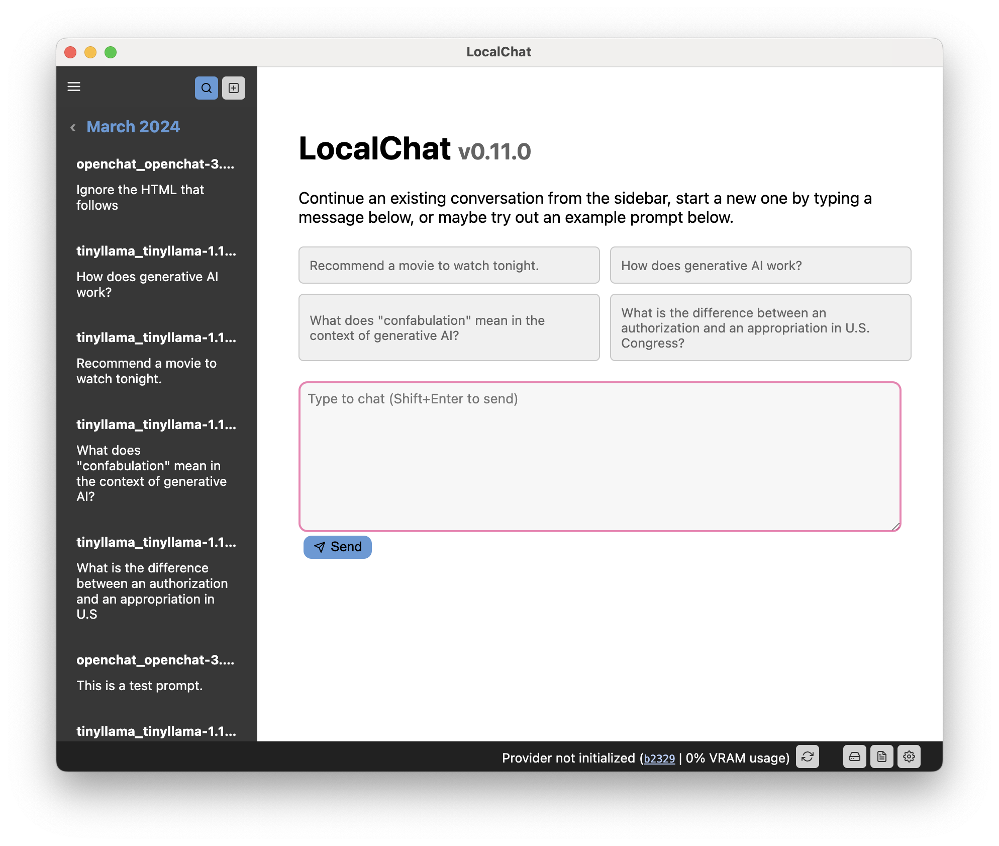

<h1 align="center">
   
  LocalChat
</h1>

> Chat with generative language models locally on your computer with zero setup. LocalChat is a simple, easy to set-up local AI chat built on top of [llama.cpp](https://github.com/ggerganov/llama.cpp). It requires no technical knowledge and enables users to experience ChatGPT-like behavior on their own machines — fully GDPR-compliant and without the fear of accidentally leaking information.

  <strong>Table of Contents</strong> 
  <a href="#overview">Overview</a> |
  <a href="#why">Rationale</a> |
  <a href="#system-requirements">System Requirements</a> |
  <a href="#quick-start">Quick Start</a>

## Overview

LocalChat provides a chat-like interface for interacting with generative **Large Language Models (LLMs)**. It looks and feels like any chat conversation, but happens locally on your computer. No data is ever transmitted to some cloud server.

There are already several extremely capable generative language models which look and feel almost like ChatGPT. The major difference is that those models run locally and are open-weight.

> [!IMPORTANT]
> As you probably already know, chatting with an LLM may feel very natural, but the models remain probabilistic: They will generate the next likely word based on what else is in the prompt. LLMs have no sense of time, causality, context, and what linguists call pragmatics. Thus, they tend to invent events that never happened, mix up facts from entirely different events, or tell straight up lies (known as "hallucination"). The same applies to code or calculations that these models can output. This being said:
> * **Never trust the model**. Confirm each and every bit of information they provides with independent research. A quick Google search for many things it outputs will give you more factually correct information.
> * **Do not blindly run code it generates**. The code may seem to work, but may also erase your entire disk.
> * **Do not trust its calculations**.
> * Try to keep each conversation on a single topic to increase the quality.
>
> Exercise caution and use this model at your own risk. Keep in mind that it is a toy, not something reliable.

### Why?

When ChatGPT launched in November 2022, I was extremely excited – but at the same time also cautious. While I was very impressed by GPT-3's capabilities, I was painfully aware of the fact that the model was proprietary, and, even if it wasn't, would be impossible to run locally. As a privacy-aware European citizen, I don't like the thought of being dependent on a multi-billion dollar corporation that can cut-off access at any moment's notice.

Due to this, I couldn't really play around with GPT and decided to wait for the inevitable: the development of smaller and better tools. By now, there are several models that tick all the boxes: They run locally *and* they feel like ChatGPT. With quantization (which basically reduces the resolution with some quality losses), they can even be run on older hardware.

However, if you don't have any experience with LLMs, it will be hard to *run* them.

The reason for why this app exists is (a) I wanted to implement this myself to see how it works ergonomically, and (b) I wanted to provide a very simple layer for interacting with these things without having to worry about setting up PyTorch and Transformers locally.

You only install the app, download a model, and off you go.

## System Requirements

This app requires a moderately recent computer to be run. However, this app depends on LLMs, which are notoriously power-hungry. Therefore, your computer hardware will dictate which models you can run.

The "regular" sized models likely need a dedicated graphics card with something between 6 and 18 GB of video memory, unless you are willing to wait more than a second per word.

Many models nowadays come in a quantized form, which makes the larger models also available for older or less powerful hardware. Quantization sometimes reduces the system requirements of even too large models quite a lot without too many quality losses (but your mileage may vary from model to model).

> [!IMPORTANT]
> As a large language model, generating responses will take a bit of time. So especially if you have no dedicated GPU in your computer, please be patient, or try out a smaller model.

## Quick Start

1. Download the app from the releases section of this repository, and install it
2. Open the model manager to receive instructions to download a model
   1. Visit Huggingface.co
   2. Download a model in GGUF-format
   3. Place that model file into the app's model directory
3. Chat!

The user interface is separated into three major components:

* The sidebar to the left contains a list of your conversations. You will need to create a new conversation to start chatting, By default, this conversation will utilize the first available model. You can change this later. Conversations and chats are persisted across restarts of the app. You can show and hide the sidebar with the small menu button at the top-left.
* The main area is occupied by the chat interface. Here you will see the current conversation's messages, can type a new one, and see how the model is generating a response.
* The status bar at the bottom gives you a few status indications as to how the app and model are doing.

## License

This code is licensed via GNU GPL 3.0. Read more in the [LICENSE file](./LICENSE).
